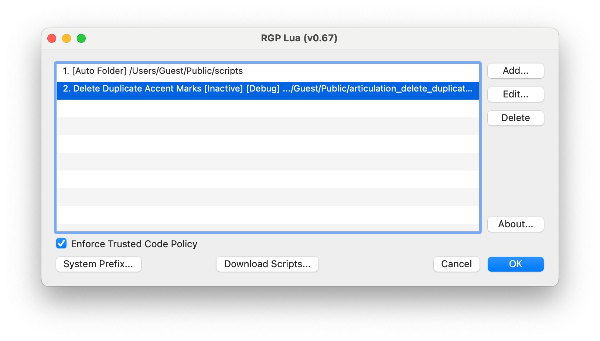
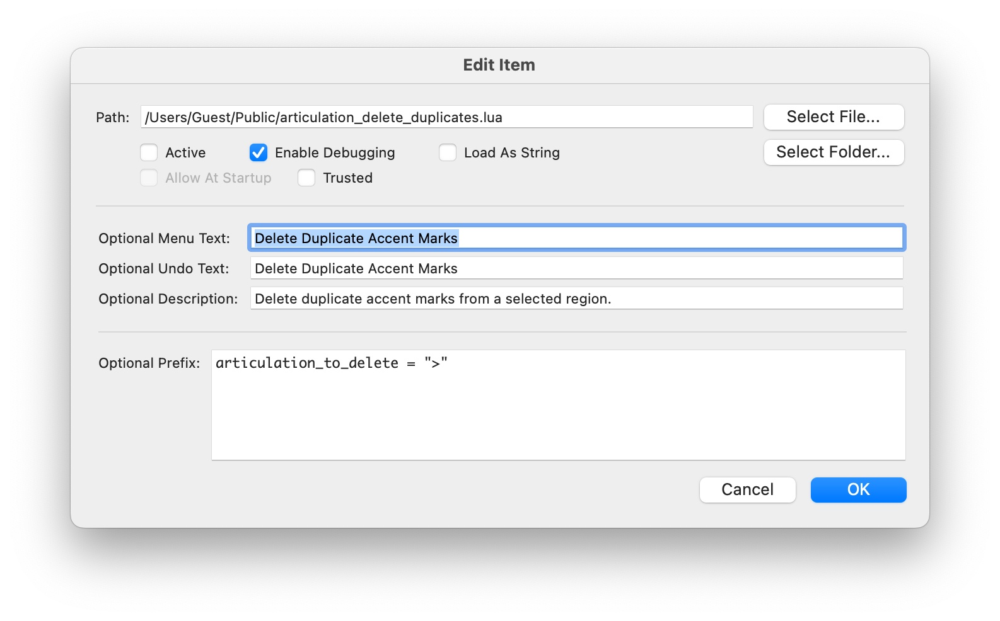

RGP Lua Configuration
=====================

When you select “RGP Lua...” from Finale's plugin menu, the following configuration dialog appears.

**List.** A list of all scripts and Auto Folders currently configured. _RGP Lua_ adds every Lua script (`*lua`) or compiled script (`*.luac`) in each Auto Folder to Finale's plugin menu except [`mobdebug.lua`](/docs/rgp-lua/development-environment), if it happens to exist.

**Add.** Opens the [Add/Edit Item Dialog](#addedit-dialog) and adds an item to the list.

**Edit.** Opens the [Add/Edit Item Dialog](#addedit-dialog) to edit the currently selected item in the list.

**Delete.** Deletes the currently selected item.

**System Prefix.** Opens the [System Prefix Dialog](#system-prefix-dialog).

**Download Scripts.** Opens the [Finale Lua](https://www.finalelua.com/) website which allows you to download scripts that can then be added to the configuration list.

List items are stored in an xml file called `com.robertgpatterson.RGPPluginSettings.xml` in the user's preferences folder. This is `~/Library/Preferences` (macOS) or `C:\Users\<username>\AppData\Roaming` (Windows).

System Prefix Dialog
--------------------

This is a multi-line text field that allows you to enter Lua code to be executed before any script or script prefix. One common use case might be to change `package.path` to include a directory for common libraries. There is no error checking, so be certain this code compiles correctly.

Note that _RGP Lua_ automatically adds the current running script path to both `package.path` and `package.cpath`. That is not necessary here.

Add/Edit Dialog
---------------

**Path.** The path of the script file or folder selected.

**Select File.** Selects a single `.lua` or `.luac` file to be included in Finale's plugin menu.

**Select Folder.** Selects a folder containing `.lua` and/or `.luac` files as an Auto Folder. _RGP Lua_ inserts every `.lua` or `.luac` file in an Auto Folder into Finale's plugin menu except `mobdebug.lua`, if it happens to exist.

**Enable Debugging.** Selecting this option enables RGP Lua debugging features. These include:

* Embedding the [`luasocket`](https://aiq0.github.io/luasocket/index.html) library into the Lua machine as global `socket` before executing the script. This allows communication with an external debugger, but it also gives affected scripts access to your network and potentially the Internet, so only use it with scripts from trusted sources.
* Reprocessing the `plugindef()` function each time the script runs. This allows for faster iteration with possibly a slight performance hit. Note that some of the properties of `finaleplugin` will not be recognized until after the next time you run the script, and a few (such as the menu text and min/max versions) will not be recognized until you restart Finale.

**Load As String.** Normally _RGP Lua_ sends the entire script file to the Lua interpreter. However, it is possible to include a non-Lua appendix delimited by a `NULL` character in the file. Selecting this option causes _RGP Lua_ to first load the file into a string and send that string to the Lua interpreter. The Lua interpreter then stops at the `NULL` character. A script file can override this option by setting `finaleplugin.LoadAsString` in the `plugindef()` function.

**Optional Menu Text.** Specifies the menu text to be used with this instance of the selected script file. If omitted, _RGP Lua_ uses the menu text returned by the `plugindef()` function in the script. If Optional Menu Text is supplied, this instance of the script will not load any `finaleplugin.AdditionalMenuOptions` configured in the `plugindef()` function. This option is not available for Auto Folders.

**Optional Undo Text.** Specifies the undo text to be used with this instance of the selected script file. If omitted, _RGP Lua_ uses the Optional Menu Text if it exists. Otherwise it uses the undo text returned by the `plugindef()` function in the script. This option is not available for Auto Folders.

**Optional Description.** Specifies the description to be used with this instance of the selected script file. If omitted, _RGP Lua_ uses the description returned by the `plugindef()` function in the script. This option is not available for Auto Folders.

**Prefix.** This is a multi-line code window that allows you to enter a brief snippet of Lua code. If a prefix exists, _RGP Lua_ executes it in the Lua environment before executing the script file. One use case for it would be to initialize some global variables that the script uses as input parameters. Another might be to require a library for a script or an Auto Folder. Each script inherits any global values set by the prefix. This prefix executes immediately *after* the [System Prefix](system-prefix-dialog), if any.

Note that you can select the same script file more than once and use the prefix and optional menu text, undo text, and description fields to tailor it to a specific use case.

This configuration process allows you quickly to add dozens or even hundreds of scripts to the _RGP Lua_ plugin menu. Finale loads them in alphabetical order and offers no further organization options. You may find the free plugin [JWLuaMenu](https://robertgpatterson.com/-fininfo/-downloads/download-free.html) to be helpful in taming the list and making your scripts easier to find and use. Version 1.05 of the plugin introduces support for _RGP Lua_, including the ability to configure separate menus for both _RGP Lua_ and _JW Lua_ in a single menu configuration file.
